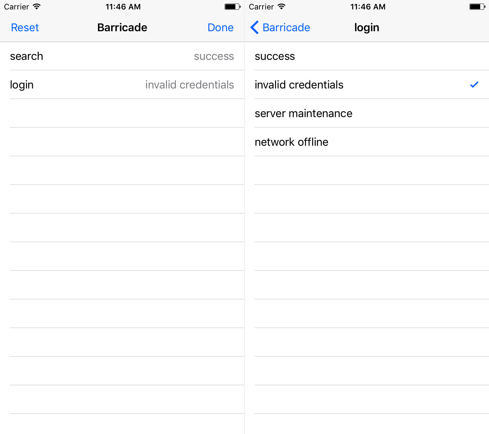

[](#cocoapods)
[](https://travis-ci.org/johntmcintosh/BarricadeKit)


[](http://doge.mit-license.org)
<!--[]()-->
<!--[](https://github.com/Carthage/Carthage)-->

# BarricadeKit

BarricadeKit is a Swift rewrite of [MMBarricade](https://github.com/mutualmobile/mmbarricade). The feature set and APIs are similar right now, but future updates will be to BarricadeKit rather than MMBarricade.

## Why Barricade?

BarricadeKit is a framework for setting up a run-time configurable local server in iOS apps. This works by creating a NSURLProtocol "barricade" that blocks outgoing network traffic and redirects it to a custom, local response, without requiring any changes to existing networking code. 

Most other local server implementations only support a single response per request, but Barricade supports multiple responses per request. This allows presentation of an interface at runtime for selecting which response will be returned. Being able to test multiple network paths without requiring a rebuild of the app is a significant time saver.

<p align="center">

</p>

## When to use 

During **development** barricade is useful for easily exercising all edge cases of a feature while you are building it without needing to frequently adjust the live server state.

For **unit tests and integration tests** barricade allows you to easily toggle through each predefined response for a request so tests can cover edge cases thoroughly.

Similarly, **UI tests**, such as [KIF](https://github.com/kif-framework/KIF), can programmatically update selected responses as well, which allows your test suite to cover failure cases as well as the "happy path".

## Installing BarricadeKit
[](#cocoapods)

The easiest way to install BarricadeKit is with [CocoaPods](https://github.com/cocoapods/cocoapods):

```Ruby
pod 'BarricadeKit', '~> 1.0.0'
```

## Selection Interface

BarricadeKit comes with an in-app interface that can be presented to allow selection of network responses at runtime. 

<p align="center">

</p>

There are two approaches you can take for presenting the selection UI:

- Automatically present the interface when the device is shaken. To do this, just replace your `UIWindow` with an instance of an `BarricadeShakeWindow`. If you're using storyboards, override `- window` in your app delegate:

```swift
    lazy var window: UIWindow? = {
        return BarricadeShakeWindow(frame: UIScreen.main.bounds)
    }()
```

*Note: By default the shake window is presented for Debug builds only. You can manually set `BarricadeShakeWindow.isEnabled` to adjust this behavior.*

- Manually present a `BarricadeViewController` at any time in your app, just be sure to limit the presetation to debug builds if you don't want it to ship to the App Store.


## App Store Submission

BarricadeKit is safe to include with App Store builds (and could be used to support things like a demo mode for your app), but most of the time you will probably want to ensure that the barricade is disabled for App Store builds. Here are a couple of approaches:

**Conditionally enable**

In your app, you can wrap the creation of the barricade inside a macro to limit the code execution to particular build configurations. For example:

```swift
#if DEBUG
Barricade.enableForDefaultSession()
#endif
```

**Disable through CocoaPods**

When installing through CocoaPods, you can specify particular build configurations to limit the installation of the library. For example:

```ruby
pod 'BarricadeKit', '~> 1.0.0', :configurations => ['Debug']
```

Or, if you are only utilizing the library for unit tests, you may want to link the library with only your testing target:

```ruby
target 'Tests', :exclusive => true do
  pod 'BarricadeKit', '~> 1.0.0'
end
```
## License

BarricadeKit is available under the MIT license. See the LICENSE file for more info.
